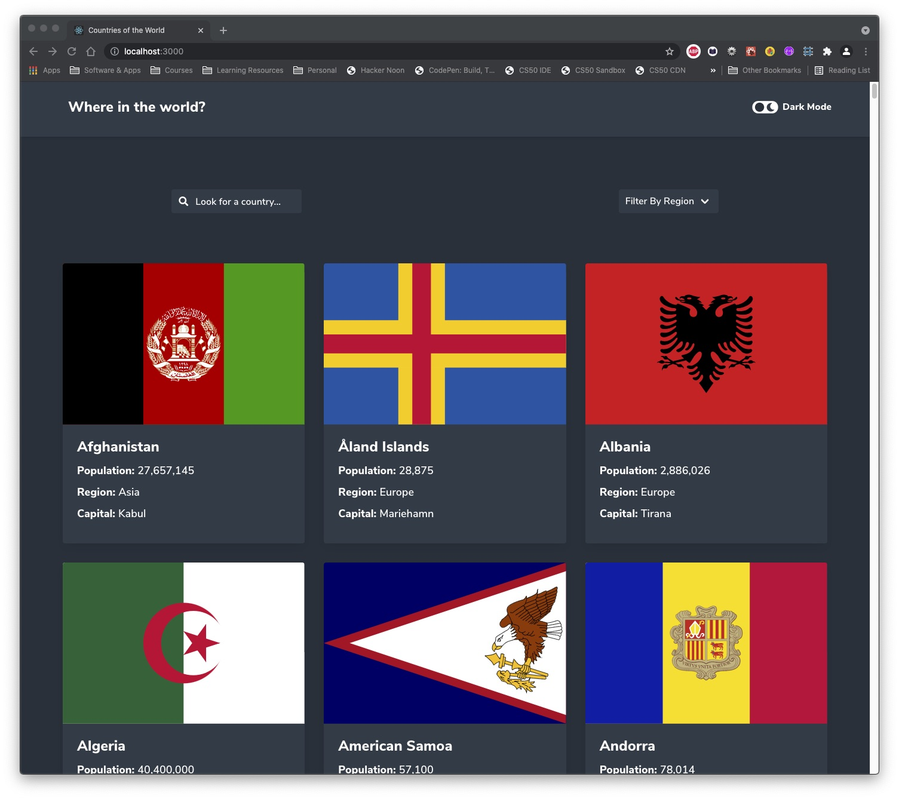

# Frontend Mentor - REST Countries API with color theme switcher solution

This is my solution to the [REST Countries API with color theme switcher challenge on Frontend Mentor](https://www.frontendmentor.io/challenges/rest-countries-api-with-color-theme-switcher-5cacc469fec04111f7b848ca). Frontend Mentor challenges help you improve your coding skills by building realistic projects. 

## Table of contents

- [Overview](#overview)
  - [The challenge](#the-challenge)
  - [Screenshot](#screenshot)
  - [Links](#links)
- [My process](#my-process)
  - [Built with](#built-with)
  - [What I learned](#what-i-learned)
  - [Useful resources](#useful-resources)
- [Author](#author)

## Overview

### The challenge

Users should be able to:

- See all countries from the API on the homepage
- Search for a country using an `input` field
- Filter countries by region
- Click on a country to see more detailed information on a separate page
- Click through to the border countries on the detail page
- Toggle the color scheme between light and dark mode

### Screenshot

### Links

- Solution URL: [https://github.com/laz-k/REST-countries-API-with-colour-theme-switcher]
- Live Site URL: [https://rest-countries-api-with-colour-theme-switcher.vercel.app/]

## My process

### Built with

- HTML5
- [Sass](https://sass-lang.com/) - CSS Preprocessor
- [Bulma](https://bulma.io/) - CSS Framework
- [React](https://reactjs.org/) - JS library
- [Styled Components](https://styled-components.com/) - For styles
- [Comma Number](https://www.npmjs.com/package/comma-number) - npm package for number formatting

### What I learned

How to build applications with React, how to use useState & useEffect, useLocation and pass data to components. How to use styled components.

### Useful resources

- [Stackoverflow](https://stackoverflow.com/) - Stackoverflow is the number 1 goto place for help.

## Author

- Website - [Laz-K](https://github.com/laz-k)
- Frontend Mentor - [@Laz-k](https://www.frontendmentor.io/profile/laz-k)
- Twitter - [@laz_kloukas](https://twitter.com/laz_kloukas)

